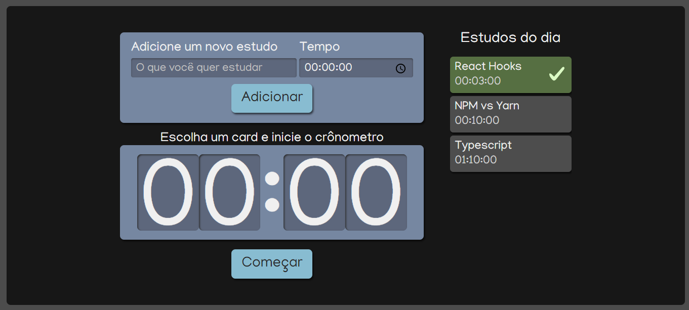

## Alura Studies
#

## Sobre o Projeto
O Alura Studies tem o objetivo de listar e cronometrar tarefas de estudo.
Projeto desenvolvido durante o curso React: escrevendo com Typescript da Alura.

### Funcionalidades:

- Adicionar tarefas com tempo de execução;
- Escolher a tarefa que será executada na lista de tarefas;
- Iniciar o cronômetro;
- Marcação como concluída a tarefa ao fim da contagem do cronômetro;

#
## Rodando o projeto

    # Clone esse repositório
    $ git clone https://github.com/flavia-dantas/alura-studies.git

    # Entre no diretório
    $ cd alura-studies

    # Instalar dependências
    $ npm install

    # Inicie o projeto
    $ npm start